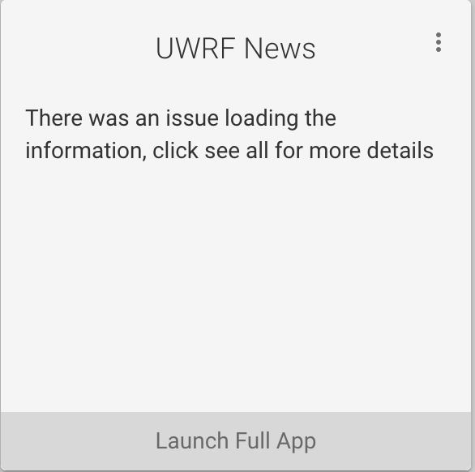

# myuw-launch-button



A button that allows users to launch a widget. This web component is only the "Launch Full App" button in the above screenshot.

## Getting Started

Add the following import to your page's `<head>`:

```html
<script type="module" src="https://unpkg.com/@myuw-web-components/myuw-launch-button@^1?module"></script>
<script nomodule scr="https://unpkg.com/@myuw-web-components/myuw-launch-button@^1"></script>
```

**Important**: For responsiveness to many screen sizes, ensure you have included the viewport meta tag in your application:

```html
<meta name="viewport" content="width=device-width, initial-scale=1">
```

Use the component's HTML tag wherever you want:

```HTML
<myuw-launch-button
    url=""
    body-text=""
>
</myuw-launch-button>
```

### Configurable properties via attributes

- **url:** (Required) Set the URL the launch button should link to
- **buttonText:** Set the text inside of the button. If attribute is not present "Launch full app" will appear

## Development and contribution

To run the demo app locally and test the component, run the following commands:

```bash
$ npm install
$ npm start
```
